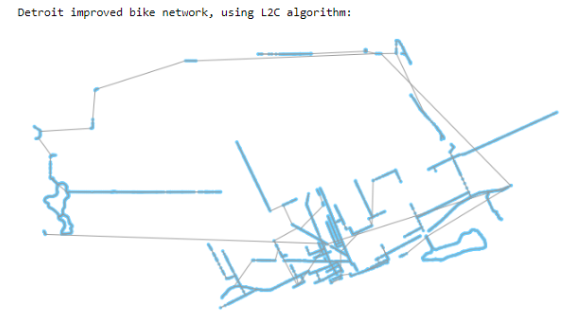
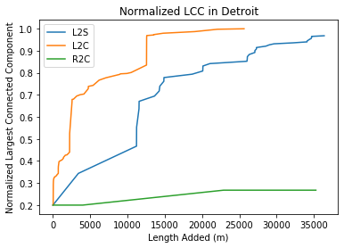
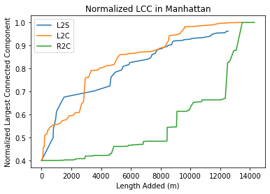

# Investigating Methodologies for Increasing the Effectiveness of Transportation Networks

[Interactive Notebook on Binder for our project can be found here.](https://mybinder.org/v2/gh/jzerez/BikeNetworks/master?urlpath=https%3A%2F%2Fgithub.com%2Fjzerez%2FBikeNetworks%2Fblob%2Fmaster%2Fcode%2FFinal%2520Notebook.ipynb)

[Static Notebook for our project can be found here.](https://nbviewer.jupyter.org/github/jzerez/BikeNetworks/blob/master/code/Final%20Notebook.ipynb)

We set out to understand how we can increase the effectiveness of bicycle paths in a city using the least amount of monetary and infrastructure resources. In our case, we define effectiveness to a combination of *Connectedness* and *Directness* of a graph. Connectedness is how many nodes are reachable from any given node, and Directness, is the ratio between the edge length between two nodes and the Euclidean distance between them. We first loaded real transportation network information for various cities into NetworkX as directed graphs. A number of different methodologies for connecting fragmented components of these graphs were used, and we measured the response of both Connectedness and Directness to each methodology. We found that a number of different methodologies that offer clear benefits over the base case of randomly connecting nodes of the graph.

## Methodology
We began by collecting transportation network information for various different cities and loaded them into NetworkX. We primarily chose to analyze the qualities of the bike layer of the transportation network because each graph is very large, and considering several layers would drastically increase run time. Additionally, looking at dedicated bike paths and working to improve them is likely going to create more change than trying to integrate bike into existing road/pathways. We decided on two metrics by which to compare paths. First is Directness, which is defined as the shortest path length from node to node versus the linear Euclidian distance between those two points. This metric is similar to commute time, and helps to roughly describe how efficiently a commuter can travel between a given points A and B using a bike. If it is impossible to travel between the two nodes, then the Directness is zero. Because graphs from real street data can have thousands of nodes, we take a random sample of  250 pairs of nodes and compute the average Directness from that small sampling, and use it to describe the average Directness of the entire graph.

The second method we calculate is Connectedness, which is measured as how many nodes exist in the largest weakly connected cluster (LCC) divided by the total number of nodes in the graph. This answers the question “how likely is it that I can reach the node I would like to go to”. We then create several algorithms to add edges to the bike network in the effort to increase these metrics with the least amount of added path length. The first method is the Largest-to-Second (L2S) algorithm. This algorithm finds all of the weakly connected subgraphs in the overall bike MiltiDiGraph and ranks them by size, then connects the largest subgraph to the second largest. Then it connects the second largest to the third largest and so on. Next is Largest-to-Closest (L2C) which finds and sorts the subgraphs then connects the largest one to the closest subgraph to it, then connects the second largest subgraph to the closest subgraph to it and so on. Next is Random-to-Closest (R2C) which connects a random subgraph to it’s closest graph, repeats for n number of desired edges to be added. Last is the Overall Closest algorithm which connects the closest subgraphs for n number of desired edges.

Original Amsterdam Graph

We implement these algorithms by defining a total amount of road to add (in meters) and then the algorithms either added paths until the sum of added lengths exceeds the defined amount, or until the graph is completely connected. We measure the Directness $$\frac{L_{path}}{L_{crow}} $$ and Connectedness $$\frac{N_{LCC}}{N_{Total}} $$ at each step and plot the length of road added vs Directness and Connectedness. We also chose to only use the L2S, L2C, and R2C methods because the Closest Overall method takes a very long time to run for large cities.

## Results

For Connectedness, we are seeing that the L2C algorithm creates a completely connected graph adding only 20 km of road, whereas the L2S algorithm needs nearly 35 km of road to become connected. The random graph does not usefully add roads, and only slightly makes the graph more connected.

We ran the same Connectedness analysis for Copenhagen and Manhattan to both compare how the algorithms perform on different cities, and to look more bike-friendly cities like Copenhagen can become more connected. For Copenhagen we only added 5km of road because the clusters are generally closer together, and for run-time purposes.

For Directness, we see that each algorithm generally follow the same trend shapes as the corresponding LCC graph. The exception to this is the behavior of the R2C algorithm, which performs better than even the L2S algorithm.

## Interpretation
The graphs show that, in general, the proposed L2C and L2S algorithms are much more effective at improving the Connectedness and Directness of bike transportation networks in cities, relative to randomly connecting components such as in the R2C algorithm. The L2C algorithm adds the paths most efficiently in terms of Connectedness, as it requires the least amount of road to achieve high levels of Connectedness (>90%). For Manhattan and Copenhagen, both the L2S and L2C algorithms have similar performance. They both solidly outperform randomly connecting nodes but don’t have much differentiation for initial rise in Connectedness. Our hypothesis for this behavior is that both Manhattan and Copenhagen have relatively short distances between their major clusters to begin with, so very often the second-largest subgraph is very close to the largest subgraph already, whereas Detroit has very spaced out subgraphs to begin with, so it is more effective to chain along the closest ones rather than jump across the city to connect larger subgraphs. It is interesting to note that the Manhattan R2C LCC graph did converge to complete by the end. We noticed this as an artifact of the randomness, sometimes the random graph would connect the largest nodes out of chance and that tends to snowball into more connected random graphs, but the initial slope of Connectedness vs invested roads is still very low and so not as effective as the other methods.

In general, the shape of the LCC graphs are quite similar to the shape of the Directness graphs. This makes logical sense that these two metrics produce very similar responses. As the fraction of total nodes of the graph contained within the largest component increase, it makes sense that the average Directness of any path would also increase. The fact that these two graphs of different metrics display very similar responses suggests that we adequately sample enough pairs of nodes in when calculating the average Directness of the entire graph. The exception to this trend is the R2C algorithm applied to Detroit. We are unsure why this is the case, but attribute part of the difference to the random choice of nodes to sample.

It is not our place to determine what parameter, Connectedness or Directness, should be held in higher regard, as that evaluation is likely a function of many additional variables that are not captured in our model. Factors such as the geographic layout of the city, prevalence of additional transportation modes, and the willingness of the population to adopt cycling as a means of transportation are all important when considering what method of adding edges is “best”. Directness and Connectedness are traits that are just generally considered good within a transportation network and offer a relatively consistent means of comparing methods.

## Extension
The cost of adding additional edges to a city’s existing bicycle transportation network is orders of magnitude less expensive than adding edges to other transportation networks. Each new mile of bike lane built costs at most $50,000, while each new mile of road built costs about two million dollars at the cheapest. Bike transportation is also better for the environment, and can lower traffic levels, as it is a denser form of transportation relative to cars. Given these clear benefits, it is strange how most cities choose not to invest more money into developing their bicycle infrastructure. We decided to try to re-quantify just how effective each strategy for adding bike paths is, taking into account how friendly a given population is to biking over driving. In other words, we wanted to quantify the use of the bike network over the car network as more and more paths were added to the bike network. Apart from public transportation in the form of trains, driving is likely the largest single alternative to biking, which is why we chose it as the ‘alternative’ method of transportation that citizens must choose between.

## Methodology
In order to see how effective each method is at increasing bike ridership, we implemented a threshold value representing how bike friendly an individual is. On one extreme, the individual will always bike between two locations, regardless of how long the bike path is. On the other extreme, the individual will always drive between two locations. In the middle is the pragmatic individual, who decides purely on the most efficient route. To implement this behavior, we weight the path lengths of taking a car versus a bike by the bike friendly parameter, $$\alpha$$, which ranges from zero to one, where $$\alpha = 0$$ means that the user will always bike, $$\alpha = 1$$ means that the user will always drive, and $$\alpha = 0.5$$ means the user will be the perfect pragmatist.

$$L_{bike}' = L_{bike} \dot (1-\alpha)$$
$$L_{car}' = L_{car}\dot \alpha$$

Here, $$L_{bike}$$ is the length of the bike path, $$L_{car}$$ is the length of the car path. After the weight to each route is applied, the user then chooses the shorter of the two weighted paths.

For a given threshold value, we can determine whether an individual will decide to bike or drive between two nodes given the relative Directness of each route. As more and more paths are added to the bicycle network, this ratio slowly changes to be in favor of the bicycle route. After each path addition, we calculate what threshold value is required for a user to decide to bike between the given nodes.

## Results
As expected, as the total length of bicycle network increases, the threshold required for an individual to decide to bike becomes lower and lower. Also unsurprisingly, as paths are added, individuals threshold values on the extremes of the spectrum do not change their behavior as more and more bike paths are added. In general, the shape of the trend follows roughly the same trend as both Directness and Connectedness.

## Interpretation
These results show two main interesting insights. Firstly, the shape of the curve the diminishing returns of adding additional paths to the bike layer, similarly to the Directness and Connectedness graphs. As more and more edges get created, the threshold for riding a bike decreases less and less. This would be important information for a city, as it would inform when to stop investing in building up the existing bicycle infrastructure.

More importantly, the graphs clearly highlight a potential reason why cities aren’t jumping to build up their bicycle networks, despite its numerous benefits. Adding additional bike paths really only makes a difference in bicycle usage for a small range of threshold values. Typically, $$0.35 < \alpha < 0.5$$. Depending on the average threshold value for a population, or the distribution of the threshold value over the population, it could potentially not make much sense to build up the bicycle network, especially if the goal of such development is to increase ridership rates. If a city is already very bicycle friendly, then adding additional paths will not increase ridership rates: most people choose to bike regardless of whether there is extra Connectedness or Directness. On the other end of the spectrum, if a city is already very car friendly, and has a very well connected car transportation network, it will take an exceedingly large number of bike lane additions to convince people to bike rather than drive.
