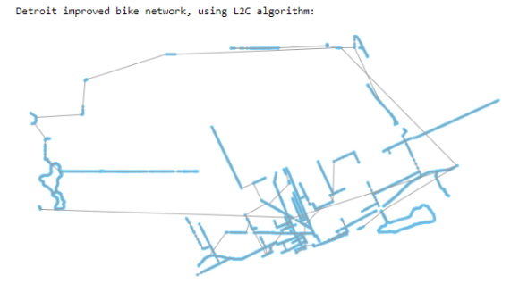

# Investigating Methodologies for Increasing the Effectiveness of Transportation Networks
### Jonathan Zerez and Nathan Lepore

## Abstract
We set out to understand how we can increase the effectiveness of bicycle paths in a city using the least amount of monetary and infrastructure resources. In our case, we define effectiveness to a combination of connectedness and directness of a graph. Connectedness is how many nodes are reachable from any given node, and directness, is the ratio between the edge length between two nodes and the euclidean distance between them. We first loaded real transportation network information for various cities into networkX as directed graphs. A number of different methodologies for connecting fragmented components of these graphs were used, and we measured the response of both connectedness and directness to each methodology. We found that a number of different methodologies that offer clear benefits over the base case of randomly connecting nodes of the graph.

## Methodology
We collected transportation network information for various different cities and loaded them into networkX. We primarily chose to analyze the qualities of the bike layer of the transportation network for various reasons. Firstly, Each graph is very large, and considering several layers would drastically increase run time. Additionally, looking at dedicated bike paths and working to improve them is likely going to create more change than trying to integrate bike into existing road/pathways.

We first compute metrics about the graphs as they currently exist. The metrics that we consider are directness and connectedness. Directness is the shortest path length from node to node versus the linear Euclidian distance between those two points. This metric is similar to commute time, and helps to answer the question “how easily can I get from point a to point b on a bike, assuming it is possible to get from point a to point b”. Connectedness is how many weakly connected components of the graph exist. It helps to answer the question "How likely is it to be able to go from any two nodes".

We employ several algorithsm to add edges to the graph.
* **Largest-to-Second (L2S)**
  * This algorithm finds all of the weakly connected subgraphs in the overall bike MiltiDiGraph and ranks them by size, then connects the largest subgraph to the second largest. Then it connects the second largest to the third largest and so on
* **Largest-to-Closest (L2C)**
  * This algorithm finds and sorts the subgraphs then connects the largest one to the closest subgraph to it, then connects the second largest subgraph to the closest subgraph to it and so on
* **Random-to-Closest (R2C)**
  * Connects a random subgraph to it’s closest graph, repeats for n number of desired edges to be added
* **Closest**
  * Connects the closest subgraphs for n number of desired edges

  
  

## Results
Preliminarily we are seeing that the Largest to Closest (L2C) is adding much fewer kilometers (98 km) of road than the Largest to Second (L2S) graph (466 km), which is to be expected based on how they add roads. We have not looked into the average path length, connectedness, or average commute time of these graphs yet, but visually it looks like the L2S graph would have more direct routes since it adds a lot of “radial” routes. On the flipside, the L2S graph produces routes that seem very difficult to add considering they cross through many current edges of the graph. We are going to work on producing more punchline graphs that plot variables we care about (average commute time, cost of roads, connectedness) to our independent variables (algorithm used, amount of road added, etc).

## Interpretation
We can look at the responses of Directness and Connectedness that each method of creating additional edges generates. In this case, interpreting the data should be relatively easy, the best method of adding additional edges to a bicycle model will be one that has the most impact to directness and connectedness for the least amount of length of road added. It is not our place to determine what parameter should be held in higher regard, as that evaluation is likely going to be a function of many additional variables that are not captured in our model. Factors such as the geographic layout of the city, prevalence of additional transportation modes, and the willingness of the population to adopt cycling as a means of transportation are all important when considering what method of adding edges is “best”. Directness and connectedness are traits that are just generally considered good within a transportation network and offer a relatively consistent means of comparing methods.
